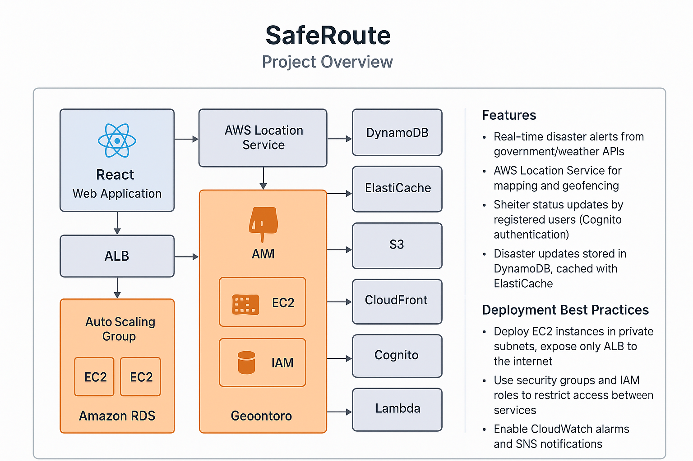

# SafeRoute

## Project Overview
SafeRoute is a React-based web application that provides real-time disaster alerts (earthquakes, floods, storms), safe routes, and shelter information. It leverages AWS services for mapping, data storage, notifications, authentication, and scalable deployment.

## Features
- Real-time disaster alerts from government/weather APIs
- AWS Location Service for mapping and geofencing
- Shelter status updates by registered users (Cognito authentication)
- Disaster updates stored in DynamoDB, cached with ElastiCache
- Static assets hosted on S3, accelerated by CloudFront
- SNS for emergency push notifications and emails
- Lambda for background data refresh tasks

## AWS Architecture

### AWS Architecture Details

- **EC2**: Hosts the React web application, deployed in multiple Availability Zones for high availability.
- **Application Load Balancer (ALB)**: Distributes incoming traffic across EC2 instances, supports health checks and SSL termination.
- **Auto Scaling Group (ASG)**: Automatically adjusts the number of EC2 instances based on demand and scaling policies.
- **Amazon RDS (Optional)**: Provides a managed relational database (MySQL/PostgreSQL) with Multi-AZ deployment for fault tolerance and backups.
- **IAM**: Manages role-based access for EC2, Lambda, RDS, and other AWS resources, enforcing least-privilege security.
- **CloudWatch**: Monitors application and infrastructure metrics, logs, and sets up alarms for performance and security events.
- **SNS**: Sends push notifications, emails, and alerts to users and administrators during emergencies or system events.
- **AWS Location Service**: Powers interactive maps, geofencing, and routing for disaster alerts and safe shelter navigation.
- **DynamoDB**: Stores real-time disaster updates and shelter information with high availability and scalability.
- **ElastiCache**: Caches frequently accessed disaster data to reduce latency and improve performance.
- **S3**: Hosts static assets (images, scripts, styles) for the web app, with versioning and lifecycle management.
- **CloudFront**: Accelerates global delivery of static assets and provides DDoS protection.
- **Cognito**: Handles user authentication, registration, and access control for shelter status updates.
- **Lambda**: Executes background tasks such as refreshing disaster data, integrating external APIs, and automating notifications.
# 

#### Deployment Best Practices
- Deploy EC2 instances in private subnets, expose only ALB to the internet.
- Use security groups and IAM roles to restrict access between services.
- Enable CloudWatch alarms and SNS notifications for system health and disaster events.
- Use Auto Scaling policies to optimize cost and performance.
- Store sensitive configuration in AWS Secrets Manager or Parameter Store.
- Enable Multi-AZ and automated backups for RDS.
- Use HTTPS for all public endpoints via ALB and CloudFront.

## Getting Started
1. Install dependencies: `npm install`
2. Start development server: `npm run dev`

## Next Steps
- Integrate AWS SDKs and configure services
- Implement disaster alert and mapping features
- Set up authentication and shelter status updates
- Connect to government/weather APIs

---

*This README provides a high-level overview. Replace placeholder integrations and assets with actual implementations as you build out each feature.*
# React + Vite

This template provides a minimal setup to get React working in Vite with HMR and some ESLint rules.

Currently, two official plugins are available:

- [@vitejs/plugin-react](https://github.com/vitejs/vite-plugin-react/blob/main/packages/plugin-react) uses [Babel](https://babeljs.io/) for Fast Refresh
- [@vitejs/plugin-react-swc](https://github.com/vitejs/vite-plugin-react/blob/main/packages/plugin-react-swc) uses [SWC](https://swc.rs/) for Fast Refresh

## Expanding the ESLint configuration

If you are developing a production application, we recommend using TypeScript with type-aware lint rules enabled. Check out the [TS template](https://github.com/vitejs/vite/tree/main/packages/create-vite/template-react-ts) for information on how to integrate TypeScript and [`typescript-eslint`](https://typescript-eslint.io) in your project.
